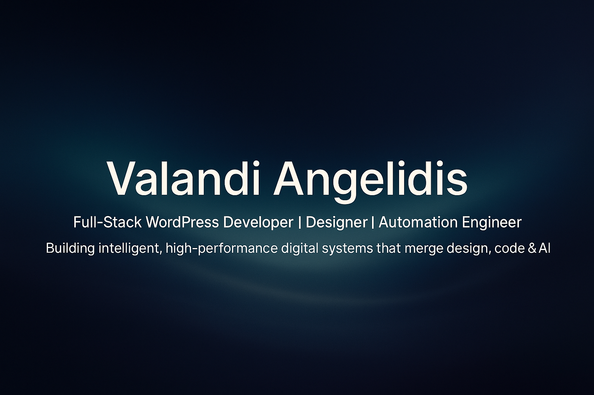

# 👋 Hi, I’m Valandi Angelidis  
💡 **Full-Stack WordPress Developer | Designer | Automation Engineer**

I craft **intelligent, high-performance, and scalable** web systems — blending **design, code, and AI automation**.  
From custom **React-based Gutenberg blocks** and **WordPress plugin ecosystems** to **AI-driven automation**,  
my work focuses on **clarity, performance, and modern architecture**.

---

### 🧠 What I Do
- 🧩 **Custom WordPress Engineering** – React Gutenberg blocks, themes, plugins  
- ⚙️ **Automation & Integration** – REST API, n8n, AI + GPT API workflows  
- 🎨 **UI/UX & Frontend Design** – modern, responsive, and accessibility-focused  
- 🚀 **Optimization** – speed, SEO, and maintainable architecture  

---

### 🧰 Tech Stack

**Languages:** PHP, JavaScript (ES6+), React, HTML, CSS, MySQL  
**CMS:** WordPress, Gutenberg, WooCommerce  
**Frameworks & Tools:** Node.js, REST API, JSON, Git, VS Code  
**Design:** Figma, Adobe CC  
**Automation:** n8n, GPT API, custom AI integrations  

---

### 🌍 Featured Projects
| Project | Description | Tech Stack |
|----------|--------------|------------|
| [**Enola Global**](https://enolaglobal.com) | Advanced LGBTQ+ social network and event platform featuring **real-time chat**, **interactive maps**, **inbuilt CRM**, and **ticketing/event management**. Built entirely with **JetEngine**, **custom PHP/JS**, and **WebSocket (SOCKS)** integrations. | WordPress, JetEngine, Custom PHP/JS, WebSocket, REST API |
| [**Helmed**](https://helmed.org) | Private, **members-only medical community** for doctors and specialists. Includes **role-based access**, **chat**, **forums**, and **integrated CRM**. Powered by custom plugins and REST integrations. | WordPress, JetEngine, Custom PHP, JS, REST API |
| [**Dr. Kartsiounis**](https://drkartsiounis.gr) | Medical website for a **Gynecologic Oncologist** specializing in **Laparoscopic & Robotic Surgery**. Features a **custom Elementor layout system** and **dynamic structure** with multilingual SEO optimization. | WordPress, Elementor, JetEngine, RankMath, TranslatePress, Custom PHP/JS |
| [**Dr. Alexandros Traianos**](https://dralexandrostraianos.gr) | Website for a **Specialist in Reproductive Medicine and Fetal Medicine**, multilingual and dynamically structured. | WordPress, Elementor, JetEngine, RankMath, TranslatePress, Custom PHP/JS |
| [**Dr. Athina Traianou**](https://drathinatraianou.com) | Dermatology & Aesthetic Medicine site with **structured data**, **custom modules**, and **local SEO**. | WordPress, Elementor, JetEngine, RankMath, Custom PHP/JS |
| [**Dr. Charis Dimopoulos**](https://dimopouloscharis.gr) | Internal Medicine website with **custom appointment system** and **local SEO architecture**. | WordPress, Elementor, JetEngine, RankMath, Custom PHP/JS |
| [**Geranion Village**](https://geranionvillage.com) | Luxury hotel site with custom booking, **localized SEO**, and **elegant UI**. | WordPress, WPML, Custom PHP/JS |
| [**Quantum Wellness**](https://quantumwellness.gr) | Wellness platform with **online booking**, **multilingual support**, and **REST API integrations**. | WordPress, Custom PHP/JS, REST API |

---

### 🧩 Open-Source Repositories

| Repository | Description | Type |
|-------------|-------------|------|
| [**pregnancy-due-date-calculator**](https://github.com/ValandiAngelidis/pregnancy-due-date-calculator) | Lightweight WordPress plugin to calculate expected due dates based on user input. Built with clean PHP logic and shortcode integration. | WordPress Plugin |
| [**easy-custom-wp-login-register**](https://github.com/ValandiAngelidis/easy-custom-wp-login-register) | Lightweight and flexible WordPress plugin that lets you **fully customize Login, Register, and Password Reset pages** — no coding required. | WordPress Plugin |
| [**rankmath-rest-api-enabler**](https://github.com/ValandiAngelidis/rankmath-rest-api-enabler) | Installable WordPress plugin that generates a Must-Use plugin to **register REST endpoints** for reading/writing Rank Math meta fields. Includes **Settings UI** and endpoint controls. | WordPress Plugin |
| [**valandiangelidis.github.io**](https://github.com/ValandiAngelidis/valandiangelidis.github.io) | My personal **portfolio website**, showcasing professional projects, case studies, and design philosophy — built with modern frontend and markdown-driven structure. | Portfolio |

---

### ⚙️ Currently Working On
- Developing **AI-powered automation plugins**  
- Expanding **Helmed** with advanced CRM integrations and role-based dashboards  
- Developing  **React Based Gutenberg block's**  

---

### 📊 GitHub Stats

---

### 💼 Portfolio & Repositories
Explore my live portfolio hosted on GitHub Pages:  
👉 [**valandiangelidis.github.io**](https://valandiangelidis.github.io)

📦 **Pinned repositories include:**
- `valandiangelidis.github.io` – Full portfolio showcase  
- `pregnancy-due-date-calculator` – WordPress due date calculator plugin  
- `easy-custom-wp-login-register` – Custom login/register pages plugin  
- `rankmath-rest-api-enabler` – REST API enabler for Rank Math  
- *(coming soon)* Gutenberg Sample Blocks  
- *(coming soon)* AI SEO Plugin  

---

### 🌈 Philosophy
> *“I see the digital world as a symphony — where logic, beauty, and emotion blend into meaningful experiences.”*

---

### 📫 Connect with Me
🌐 [valandiangelidis.com](https://valandiangelidis.com)  
💼 [LinkedIn](https://linkedin.com/in/valandiangelidis)  
✉️ [info@valandiangelidis.com](mailto:info@valandiangelidis.com)  
🐙 [GitHub Portfolio](https://valandiangelidis.github.io)

---

⭐ *If you enjoy my work or want to collaborate, feel free to star, fork, or reach out — I’m always open to exciting projects.*
